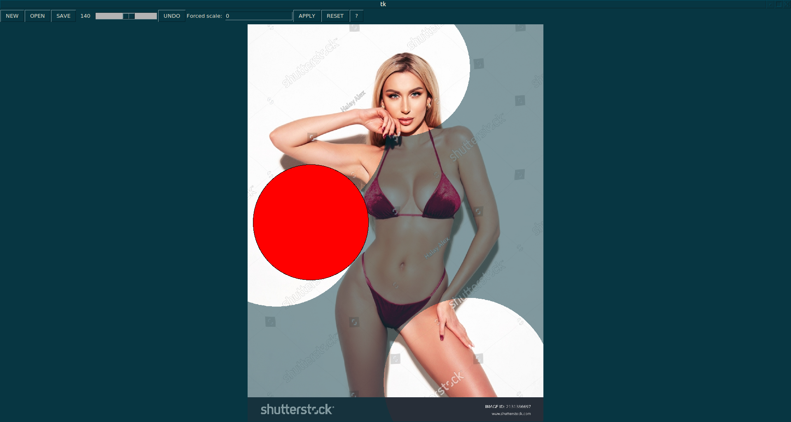
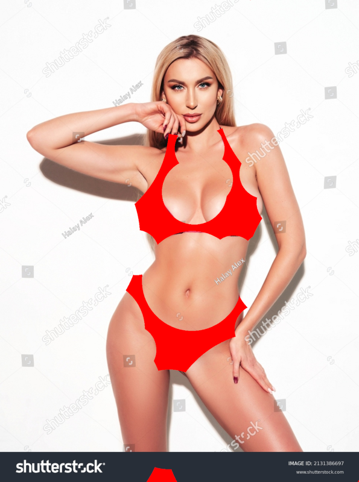

# bubbling-editor
Simple Tkinter image bubbling editor
```
<Control-o> - open project
<Control-s> - save project
<Control-n> - import image
<Left-click> - draw bubble
<Right-click> - draw counter bubble
<Mouse-wheel> - change bubble size
<Control-z> - remove last-bubble
<Control-e> - export project
```

Typical workflow:
```
1. import image or open project
2. add bubbles
3. save project
4. export image
```
Export project from command-line: `bubbling-editor -p <path-to-project> -i <path-to-image>`

Screenshot



Result

